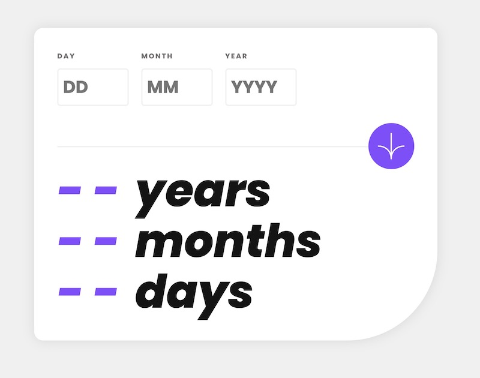

# Frontend Mentor - Age calculator app solution

## Overview

### The challenge

Users should be able to:

- View an age in years, months, and days after submitting a valid date through the form
- Receive validation errors if:
  - Any field is empty when the form is submitted
  - The day number is not between 1-31
  - The month number is not between 1-12
  - The year is in the future
  - The date is invalid e.g. 31/04/1991 (there are 30 days in April)
- View the optimal layout for the interface depending on their device's screen size
- See hover and focus states for all interactive elements on the page
- **Bonus**: See the age numbers animate to their final number when the form is submitted

### Screenshot



### Links

- Solution URL: [1º Frontend Mentor Solution](https://www.frontendmentor.io/solutions/basic-and-flawed-html-and-css-solution-with-flexbox-and-simple-script-iOdaqShoSt)
- Live Site URL: [GitHub Pages](https://shiguita.github.io/FM-age_app/)

## My process

For the development of this project, I first decided to focus on the design. Using simple HTML, I tried to get things to look as close as possible to the provided images. My initial CSS was messy, but I was able to get it to look as intended. However, my knowledge of making responsive websites was almost nonexistent, so I decided to leave that for a future revision.

When I moved on to the JavaScript portion of the project, I initially thought that the code would be quite simple. However, I soon realized that the task was much more complex than I anticipated. In order to make a complete calculator, I had to take into account many possibilities if I wanted to deal with every single situation. Once again, I opted for a simpler approach.

My first solution wasn't working correctly for most cases, but after some research, I found a useful [article](https://dev.to/code_mystery/javascript-age-calculator-calculate-age-from-date-of-birth-o9b) that provided a cleaner solution for dealing with invalid dates. With this code, I was able to effectively calculate the age and had a workable solution. The first comment in the article gave an even better approach for calculating the age so I used it for my own solution.

After publishing my initial solution and studying others on Frontend Mentor, I realized that there were many different approaches to styling and scripting. Most solutions left one or two things unfinished, such as failing to design a responsive website or being unable to deal with certain dates. However, I did find a solution by [Alamin](https://github.com/CodePapa360/Age-Calculator-app) that I believe was the best of all the ones I reviewed. This solution taught me a lot about how to set up CSS for a desktop and mobile-compatible design and had the best approach for the JavaScript. With this help, I was able to modify my solution and create a result that I am really satisfied with

### What I learned

I finally decided to use `@media` to get a responsive design that allowed me to define first values for the mobile view and then modify them when the width permitted it.

```css
@media screen and (min-width: 48em) {
  html {
    font-size: 120%;
  }
  main {
    padding: 2rem;
    min-width: 35rem;
    border-radius: 15px 15px 150px 15px;
  }
  ...;
}
```

On the Javascript front I learned about the usage of _events_, functions and working with _Date()_ objects. My solution validates the values when the submit button is pressed

```js
document.getElementById("form").addEventListener("submit", function (e) {
  e.preventDefault();
  const vDay = validateDay(inputDay);
  const vMonth = validateMonth(inputMonth);
  const vYear = validateYear(inputYear);
  if (!vDay || !vMonth || !vYear) return;

  const birth = new Date(
    `${inputYear.value}-${inputMonth.value}-${inputDay.value}`
  );

  if (!validateDate(inputDay, inputMonth, inputYear, birth)) return;
  .
  .
  .
}
```

After that it's only a matter of calculating the age and using an animation for displaying the numbers

```js
const diff = new Date(Date.now() - birth.getTime());
const days = Math.abs(diff.getUTCDate() - EPOCH_DAY);
const months = Math.abs(diff.getUTCMonth() - EPOCH_MONTH);
const years = Math.abs(diff.getUTCFullYear() - EPOCH_YEAR);

[
  outputYear.parentElement,
  outputMonth.parentElement,
  outputDay.parentElement,
].forEach((output) => {
  output.style.transform = "scale(.8)";
  output.style.opacity = "0";
});

// Updating the output elements with the calculated years, months and days,
// then scaling up and showing them after a delay of 300ms
setTimeout(() => {
  outputYear.textContent = years;
  outputMonth.textContent = months;
  outputDay.textContent = days;

  [
    outputYear.parentElement,
    outputMonth.parentElement,
    outputDay.parentElement,
  ].forEach((output) => {
    output.style.transform = "scale(1)";
    output.style.opacity = "1";
  });
}, 300);

// Clearing the input fields after calculating the age
inputDay.value = "";
inputMonth.value = "";
inputYear.value = "";
```
